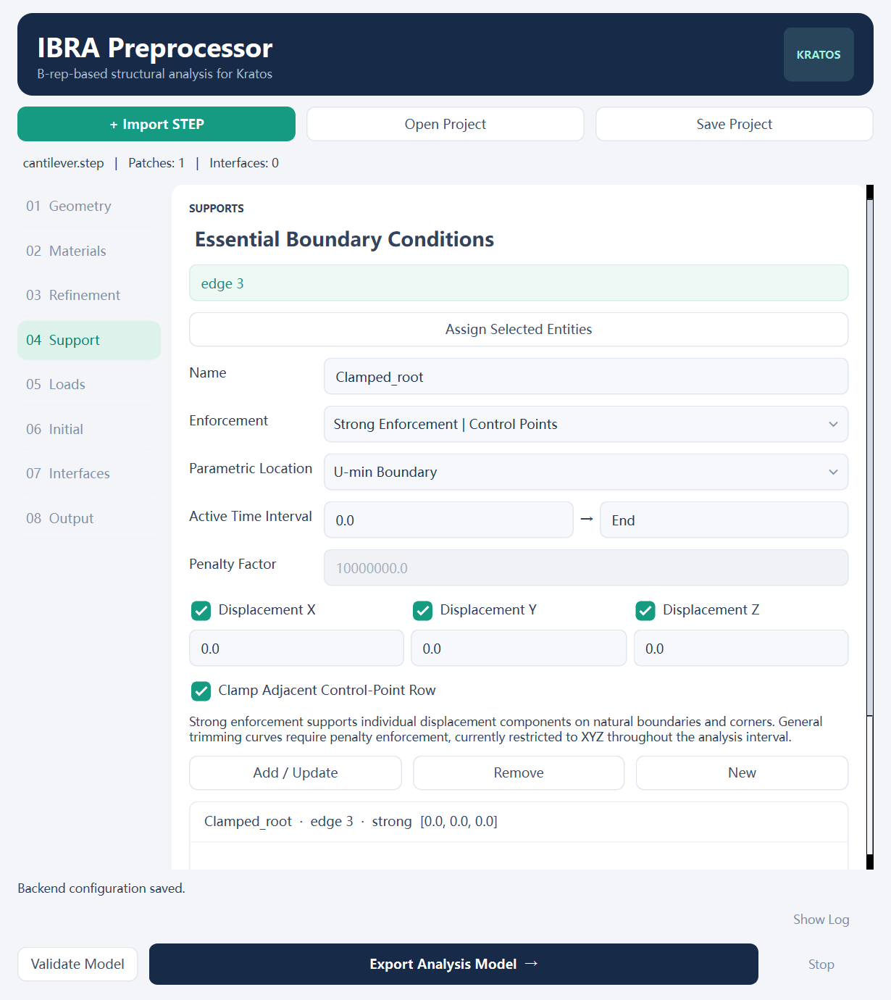

# IBRA Preprocessor for Kratos

A native FreeCAD workbench for **isogeometric B-rep analysis (IBRA)**. Import STEP geometry, assign shell or membrane formulations, materials, refinement, boundary and initial conditions, and export a complete Kratos structural analysis model.

**Branch:** `freecad-ibra-preprocessor` · **Version:** 0.2.0

[Installation — English](docs/Installation_en.md) · [安装指南 — 中文](docs/Installation_zh.md)

[User guide — English](docs/User_Guide_en.md) · [使用说明 — 中文](docs/User_Guide_zh.md)



## Download and configure

Select this branch, then **Code → Download ZIP**, and extract it into a stable directory. Alternatively:

```text
git clone --branch freecad-ibra-preprocessor https://github.com/adkl1117/STEP2IBRA.git
```

Follow the installation guide. It covers a separate Python 3.11 environment, dependency installation, an environment check, and copying the workbench into the exact FreeCAD user module directory. FreeCAD, OCCT and Kratos binaries are not included. The STEP conversion source **is bundled**, so no previous project or author-specific folder is required.

The verified platform is Windows x64 with FreeCAD 1.1.3. Other platforms require compatible binary wheels and have not been validated in this distribution.

## Capabilities

- Exact NURBS surfaces, trimming p-curves and B-rep topology from STEP/STP.
- Kirchhoff–Love shells and membranes, multiple materials and patch assignments.
- Knot insertion, degree elevation and quadrature settings.
- Essential boundary conditions, distributed loads and initial fields.
- Penalty interface coupling, with optional rotational continuity for shells.
- Standalone Kratos export, initialization and solution.
- English GUI and separate Chinese/English documentation.

`geometry.cad.json` contains geometry. A runnable case also includes physics and refinement definitions, materials, solver parameters and Python processes. Official Kratos identifiers such as `IgaApplication` remain unchanged for compatibility.

## Repository layout

```text
freecad/Mod/KratosIBRA/   Installable, self-contained workbench
  backend/cad_pipeline/  STEP conversion source
  examples/cantilever/   Synthetic STEP and a portable configured project
  kratos_iga/            GUI, project validation and Kratos export
scripts/                 Installation and example verification
tests/                   Geometry, export, solver and portability tests
docs/                    Installation, operation and validation evidence
requirements-backend.txt Required backend packages
```

## Verification and scope

The cantilever-shell example checks displacement against an analytical value of 0.02 mm. The test suite also exercises initial fields, timed loads, geometry checks, invalid configurations and relocation. See [validation evidence](docs/Validation.md) for the tested environment and reproducible commands.

The current scope is surface shells and membranes. Independent beams, volumetric parameterization, solid elements, contact and general trimming-vertex point conditions are not implemented. Geometric interface detection does not determine connection mechanics; engineering use requires constraint, penalty and convergence studies.

## License

The workbench and bundled project conversion source are provided under the [MIT License](LICENSE). External dependencies retain their own licenses; see [third-party notices](THIRD_PARTY_NOTICES.md).
